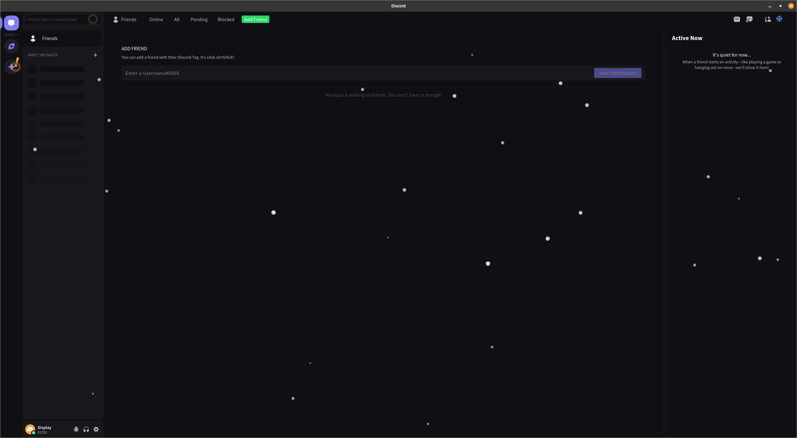

# Snowcord

A simple plugin that adds a snowy effect to Discord.

## Installation
### Github
1. Download the `Snowcord.plugin.js` file
2. Drag it into your BetterDiscord plugins directory

## My Other Plugins
- [SplitLargeFiles](https://github.com/ImTheSquid/SplitLargeFiles)
- [StickerSnatcher](https://github.com/ImTheSquid/StickerSnatcher)
- [SettingsSync](https://github.com/ImTheSquid/SettingsSync)